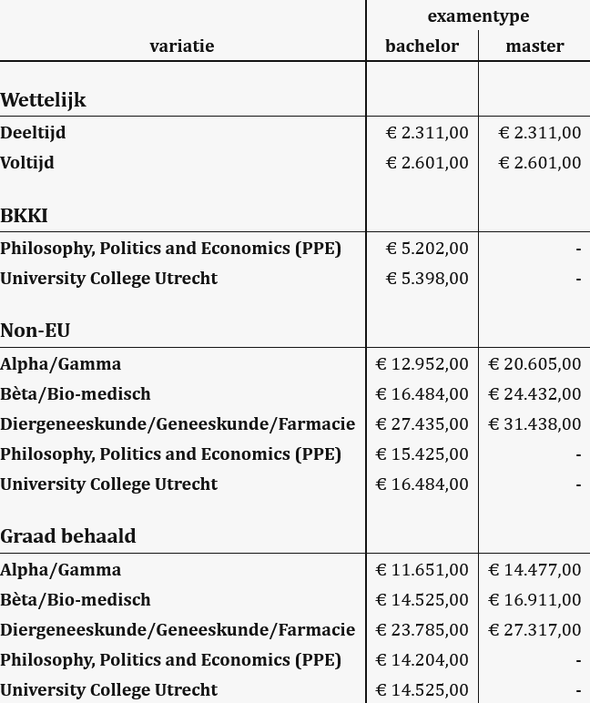

# data-viewer

A lightweight vanilla JavaScript web component for displaying structured table data with support for multi-level headers, sections, and formatters.

[Live Demo](https://lcvriend.github.io/wc-simple-table/)

## Features

- Zero dependencies
- Multi-level column/row headers
- Section headers from index levels
- Data type-based formatting
- Customizable styling through attributes and CSS
- Responsive to data changes
- Event handling for cell interactions

## Installation

```html
<script type="module" src="src/viewer.js"></script>
```

## Basic Usage

```html
<data-viewer src="data.json"></data-viewer>
```

## Example Output

### Simple table


### Multi-level headers


### Section headers

